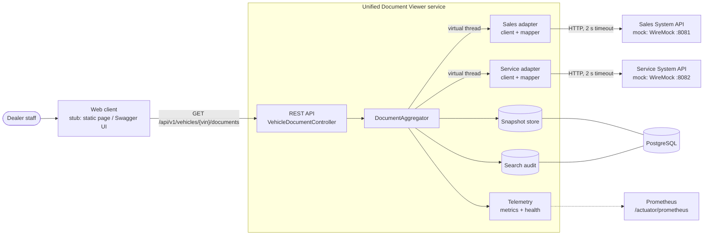

# System Design: Unified Document Viewer

Keyloop technical assessment, **Scenario D** (domain: Operate). The backend is implemented fully;
the client layer is stubbed with an OpenAPI contract, cURL examples, an IntelliJ HTTP file and a
minimal HTML test harness.

## 1. Problem

Documents about a vehicle live in separate dealership systems: sales invoices and finance
agreements in the Sales system, repair orders and inspection reports in the Service system.
Staff have to search each system separately. The goal is **one search by VIN that returns one
consolidated list, showing which system each document came from**.

### Requirements (from the brief)

1. **Unified Search:** a single interface where a user enters a VIN.
2. **Data Aggregation:** the backend makes **parallel** requests to two mocked external APIs, a
   Sales System API and a Service System API.
3. **Aggregated View:** a single consolidated list of documents from both sources, clearly
   indicating the source system of each.
4. Backend option: a RESTful API and a persistent database.
5. Consider scalability, performance, reliability, maintainability and observability.

## 2. Assumptions

The brief leaves these open; each is a decision I made and can revisit.

| # | Topic | Assumption |
|---|---|---|
| A1 | Partial failure | If one system is slow or down, return the other system's documents with `partial: true` and a status per source. Failing the whole search would make one system's outage an outage of both. |
| A2 | Total failure | If no system answers **and** nothing is stored, return **503** (`application/problem+json`). "We could not check" must not look like "this vehicle has no documents" (200 with an empty list). |
| A3 | What is persisted | (a) the **last known documents per VIN and source**, served flagged `stale` when that source fails; (b) a **search audit** row per search. Documents themselves (PDFs) stay in the source systems; we store metadata and links only. |
| A4 | Timeouts | 2 s per source by default (configurable), 500 ms to connect. A search therefore takes at most about 2 s. |
| A5 | Retries | No retries on the request path: a retry adds latency to a user who is waiting, and the stale fallback already covers failures. |
| A6 | VIN validation | ISO 3779 format: 17 characters, letters and digits, no I/O/Q; case-insensitive input. The check digit is not validated because it is only mandatory for North American VINs. |
| A7 | Duplicates | Documents are not de-duplicated across systems; the same real-world event recorded in both systems is two documents with two sources. The id is `SOURCE:externalId`. |
| A8 | Ordering | Newest first by issue date; undated documents last. The Sales system only provides a date, which is taken as start of day UTC. |
| A9 | External API contracts | Unknown to us, so the mocks model two realistic vendors that differ in field names, nesting, date precision and not-found conventions (Sales: 404, Service: 200 with an empty list). See `mocks/README.md`. |
| A10 | Security | Out of scope for the assessment. In production the API would sit behind the platform's OAuth2/OIDC gateway, with a dealer/tenant claim restricting which VINs a user may search. |
| A11 | Personal data | A VIN can identify a person's vehicle. Logs carry a masked VIN (`1HG**********4352`); the full VIN is kept only in the database for audit. |

## 3. Architecture



### Components

| Component | Package | Role |
|---|---|---|
| REST API | `api` | Validates the VIN, calls the aggregator, maps the result to the response contract, and turns failures into RFC 9457 problem responses (400 invalid VIN, 503 no source available). |
| Aggregator | `aggregation` | The core business logic: starts every source call in parallel, applies each source's deadline, merges and sorts the documents, refreshes snapshots, falls back to them on failure, records audit and metrics. |
| Domain | `domain` | Framework-free model (`Vin`, `Document`, `SourceResult`, `AggregatedDocuments`) and the ports the aggregator depends on (`DocumentSource`, `DocumentSnapshotStore`, `SearchAuditRecorder`). |
| Source adapters | `source.sales`, `source.service` | One per external system: an HTTP client with explicit timeouts plus a mapper from that system's wire format to `Document`. This is the anti-corruption layer: the rest of the code never sees vendor DTOs, and a third system is one more adapter. |
| Persistence | `persistence` | JPA implementations of the snapshot store and the audit recorder. The schema is owned by Flyway; Hibernate only validates it. |
| Observability | `observability` | Correlation-id filter, MDC/tracing propagation to worker threads, per-source metrics, and the `documentSources` health indicator. |
| Mock source systems | `mocks/` | Two WireMock servers with deliberately different APIs and scenario VINs for slow, failing and missing data. The same files drive the demo and the tests. |

## 4. Data flow

1. The client calls `GET /api/v1/vehicles/{vin}/documents`. The correlation-id filter reuses a
   safe `X-Correlation-Id` header or generates one, puts it in the MDC and echoes it back.
2. The controller normalizes and validates the VIN (400 if invalid).
3. The aggregator submits one task per source to a bounded, virtual-thread executor. The
   executor's decorator copies the tracing context and MDC onto each task.
4. Each adapter calls its system over HTTP (read timeout = source timeout), forwarding the
   correlation id and trace headers, and maps the response to `Document`s. A 404 from Sales is
   an empty list; a 5xx, connection failure or unreadable body is `ERROR`; a timeout is `TIMEOUT`.
5. The aggregator waits for each task up to that source's deadline (`orTimeout`), so the search
   takes as long as the slowest source, capped at the timeout.
6. For each source:
   - **OK:** replace that source's snapshot for the VIN (delete and insert in one transaction).
   - **Failed:** load the last known snapshot; if found, include it flagged `stale`.
7. Record one audit row (VIN, correlation id, duration, outcome per source) and per-source metrics.
8. If no source answered and nothing was stored, respond 503. Otherwise respond 200 with the
   merged, sorted list and a status block per source.

Snapshot and audit writes never fail a search: a database problem is logged and degrades the
fallback only.

### API contract (abridged; full spec at `/v3/api-docs`)

```json
{
  "vin": "5YJSA1E26HF000001",
  "retrievedAt": "2026-09-25T10:00:00Z",
  "partial": true,
  "sources": [
    { "system": "SALES",   "displayName": "Sales System",   "status": "OK",      "documentCount": 2, "latencyMs": 163,  "stale": false },
    { "system": "SERVICE", "displayName": "Service System", "status": "TIMEOUT", "documentCount": 1, "latencyMs": 2001, "stale": true }
  ],
  "documents": [
    { "id": "SERVICE:A-7001", "source": "SERVICE", "sourceDisplayName": "Service System", "type": "REPAIR_ORDER",
      "title": "Tyre replacement", "reference": "RO-7001", "issuedAt": "2025-02-10T09:00:00Z",
      "url": "https://service.dealer.example/attachments/A-7001", "stale": true },
    { "id": "SALES:S-2001-INV", "source": "SALES", "sourceDisplayName": "Sales System", "type": "SALES_INVOICE",
      "title": "Sales invoice #2001", "reference": "D-2001", "issuedAt": "2024-06-01T00:00:00Z",
      "url": "https://sales.dealer.example/documents/S-2001-INV", "stale": false }
  ]
}
```

### Data model

```
document_snapshot  id uuid PK · vin · source · external_id · document_type · title · reference
                   · issued_at · url · fetched_at      UNIQUE (vin, source, external_id)
search_audit       id uuid PK · vin · correlation_id · requested_at · duration_ms · partial
                   · document_count · source_outcomes ("SALES=OK,SERVICE=TIMEOUT")
                   INDEX (vin, requested_at desc)
```

## 5. Reliability, scalability and performance

- **Isolation of slow dependencies:** per-source timeouts, and the HTTP read timeout releases the
  thread even though `orTimeout` cannot cancel a call in progress.
- **Graceful degradation:** partial results, then stale data, and 503 only when there is nothing to show.
- **Stateless service:** everything shared is in PostgreSQL, so instances scale horizontally
  behind a load balancer. (The last-seen status behind the health indicator is per instance and
  informational only.)
- **Bounded concurrency:** virtual threads remove thread-pool sizing, but outbound calls are
  capped (`docviewer.aggregation.max-concurrent-source-calls`) to protect the source systems
  during load spikes.
- **Database efficiency:** lookups use the `(vin, source, external_id)` unique index; snapshots
  are replaced with one bulk delete plus batched inserts; ids are generated by Hibernate so
  inserts do not trigger a SELECT per row; open-session-in-view is disabled.
- **Known limitations and next steps:**
  - A **circuit breaker** per source (e.g. Resilience4j) to stop waiting for a system that is
    known to be down. Today every search waits the full timeout for a dead source.
  - A **short-lived cache** (e.g. 60 s) if the same VIN is searched repeatedly.
  - **Snapshot retention:** snapshots are never deleted; add a TTL job and a documented retention period.
  - A **trace exporter** (OTLP to Tempo/Jaeger): trace ids are in logs and headers, but spans are not exported yet.

## 6. Observability

| Signal | Implementation | Used for |
|---|---|---|
| **Logs** | Structured JSON (Elastic Common Schema) with `correlationId`, `traceId` and `spanId` from the MDC on every line, including lines logged on source-call threads. VINs are masked. | Following one search across threads and systems. |
| **Metrics** | `docviewer.source.requests` timer tagged `source` and `outcome` (ok/timeout/error), with a percentile histogram; `docviewer.source.fallbacks` counter; standard HTTP server, JVM and HikariCP metrics. Exposed at `/actuator/prometheus`. | p95/p99 latency and error or timeout rate per source; alert when a source's error rate or fallback rate rises. |
| **Tracing** | Micrometer Tracing (Brave bridge). The inbound request is the parent span; the two outbound calls are child spans started in parallel; W3C `traceparent` is propagated to the source systems. | Seeing that both calls overlap and which one was slow. |
| **Health** | `/actuator/health` includes `documentSources` (last outcome per source; `DEGRADED` but HTTP 200 when one failed). Liveness and readiness exclude it, so a failing dependency never restarts or de-routes healthy instances. | Dashboards; Kubernetes probes. |
| **Audit** | `search_audit` table with correlation id. | Support: "what did this user see at 10:03 and why?" |

Example alerts: service error rate over 5% for 5 minutes; p95 latency over 1.5 s; fallback rate rising.

## 7. Technology choices

| Choice | Why | Alternatives considered |
|---|---|---|
| **Java 25 + Spring Boot 4.1** | Current LTS and current Boot line. Strong ecosystem for REST, persistence, observability and testing; widely known, so easy to maintain. | Kotlin (same platform, smaller hiring pool); Node.js (fine for I/O, weaker typing for the domain). |
| **Virtual threads + `CompletableFuture`** | Parallel blocking I/O with plain, debuggable code: stack traces, `ThreadLocal`-based MDC and tracing all keep working. See [ADR 0001](adr/0001-parallel-calls-with-virtual-threads.md). | WebFlux/Reactor (more complex code and debugging for a two-call fan-out). |
| **Spring `RestClient` over JDK `HttpClient`** | Explicit connect and read timeouts, built-in observation (tracing and metrics), no extra dependency. | OpenFeign (extra dependency, less control over error mapping). |
| **PostgreSQL + Flyway + Spring Data JPA** | Reliable relational store; versioned, reviewable migrations; JPA is enough for two simple tables. See [ADR 0003](adr/0003-persistence-snapshots-and-audit.md). | MongoDB (no benefit for this shape); Redis (fine for caching, weaker for audit). |
| **WireMock** (Docker for the demo, in-JVM for tests) | Real HTTP with configurable latency and faults, one set of mapping files for both. | In-app fake controllers (not real network behaviour). |
| **Testcontainers** | Integration tests against real PostgreSQL, not an in-memory substitute. | H2 (different SQL dialect, false confidence). |
| **Micrometer + Actuator + Prometheus** | Vendor-neutral metrics and tracing facade; Prometheus is the de-facto standard. | Vendor agents (lock-in). |
| **springdoc-openapi** | The OpenAPI contract is generated from the code, so it cannot drift from it. | Hand-written spec (drifts). |

## 8. Testing strategy

| Level | What | Examples |
|---|---|---|
| Unit | Core business logic with fakes, no Spring | Parallelism (two 600 ms sources finish in under 1 s), timeout isolation, stale fallback, 503 rule, sort order, VIN rules, MDC propagation, database failure does not fail the search |
| Adapter | Each client against WireMock using the demo mapping files | Mapping, 404, 500, connection reset, slow response becomes TIMEOUT, unknown fields tolerated, upstream error body not leaked, correlation id forwarded |
| Tracing | Full stack with an in-memory span collector | The two source calls share the request's trace, are its child spans, and overlap in time |
| Integration | Full HTTP stack + PostgreSQL (Testcontainers) + both mocks | Consolidated response contract, partial result within the timeout, stale fallback across two requests, 503 and 400 problem responses, audit row, metrics, health, OpenAPI |

The parallelism and tracing tests were checked by mutation: sequential calls fail the first, and
removing context propagation fails the second.

## 9. How I used GenAI in the design phase

I used the assistant to widen the options and speed up the drafting. The decisions and the
checking stayed with me. Each design activity below had a clear split of roles.

| Design activity | What the AI did | What I did | Result in this document |
|---|---|---|---|
| **Understand the problem** | Extracted requirements, deliverables and evaluation criteria from the brief and the job description | Chose the scenario, the layer to build and the stack from that list | Section 1 |
| **Resolve ambiguity** | Listed the points the brief leaves open, with a proposed answer for each | Required each answer to be written down as a numbered assumption, separate from the brief | Section 2 (A1–A11) |
| **Compare options** | Named the alternatives for each major choice and argued the trade-offs | Reviewed them against the brief's scope and how easily a team could maintain the result | Three ADRs; section 7 |
| **Control scope** | Initially proposed a circuit-breaker library | Deferred: timeouts plus the stale fallback already meet the brief, and its Spring Boot 4 support was unconfirmed | Section 5, "next steps" |
| **Fact-check the design** | Stated how libraries behave | Required each claim to be confirmed in the dependency jars or proven by a test | Sections 6 and 8 |

**Three moments where checking changed the design:**
1. **Requirements vs assumptions.** Asked to prove its `CLAUDE.md` against the PDF, the assistant
   was shown to have presented its own choices (endpoint path, partial-failure rule) as Keyloop's
   requirements. That became the rule this document follows: the brief is quoted, and everything
   else is a challengeable assumption.
2. **An untested claim.** Section 6 said the two source calls appear as parallel spans in one
   trace, but nothing proved it. A tracing test now does, and it was shown to fail when context
   propagation is removed.
3. **A broken diagram.** The architecture diagram rendered as raw code on GitHub because of an
   unquoted `{vin}` label. I spotted it; the labels are now quoted and the diagram was checked
   in three Mermaid versions.

**What I would do the same way again:** settle the requirements and assumptions *before* asking
for a design, and treat every AI statement about a library as a hypothesis to verify.
